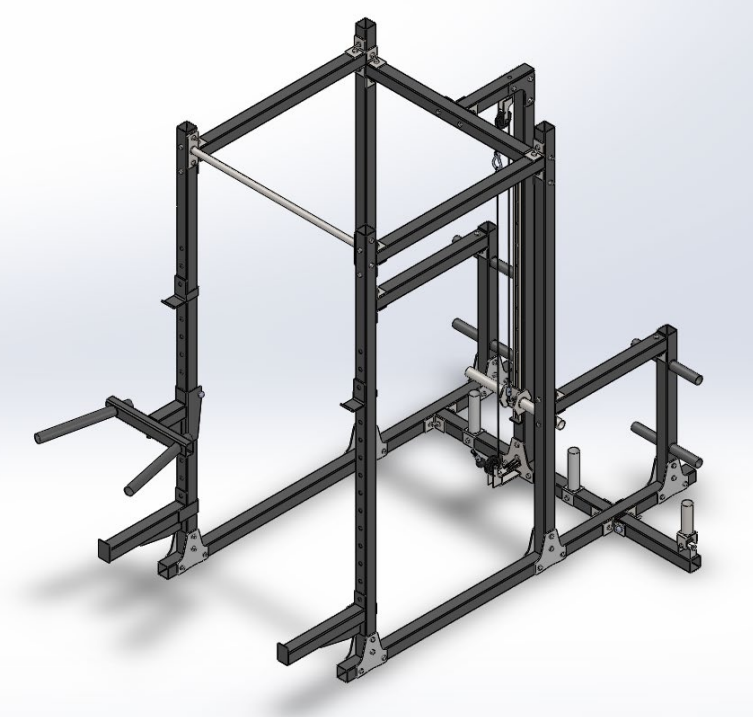
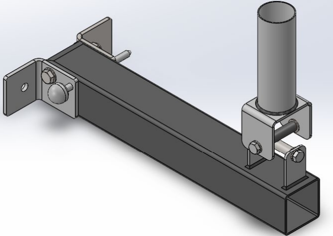
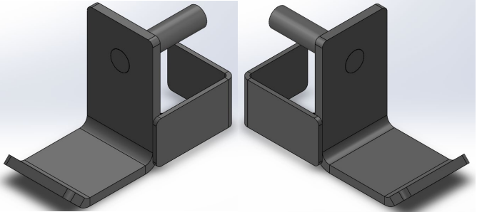

# Multi-Function Training Structure

## Project Description

This project involves the design and structural calculation of a multi-function training structure for home use. The goal is to create a versatile and affordable training equipment for home use.

## Technologies Used

- **3D Modeling**: SolidWorks
- **FEM Analysis**: SolidWorks
- **Technical Documentation**: AutoCAD

## Repository Contents

- `/cad_models`: Contains CAD files in .stl, .step, .iges formats.
- `/fem_analysis`: Results and FEM analysis scripts performed in SolidWorks.
- `/documentation`: Technical drawings and project documentation in PDF format.

## Installation and Usage

To view and modify the CAD models:

1. Clone the repository: `git clone https://github.com/sergio-moldes/entrenamiento-multifuncion.git`
2. Open the files in SolidWorks.

## Contributions

Contributions are welcome. Please open an issue or submit a pull request to discuss any changes you wish to make.

## License

This project is licensed under the MIT License - see the [LICENSE](LICENSE) file for details.

## Project Documentation

The project has been thoroughly documented in the following PDF file: [Multi-Function Training Structure Documentation](documentation/Memoria_entrenamiento_multifuncion.pdf)

### Documentation Summary

#### 1. Introduction

Describes the project objective and provides an overview of the multi-function training structure design.

#### 2. Calculations and Design

Detailed explanation of the calculations performed to ensure the stability and safety of the structure, as well as the CAD design process.

### Project Images

Here are some images of the final CAD design:

