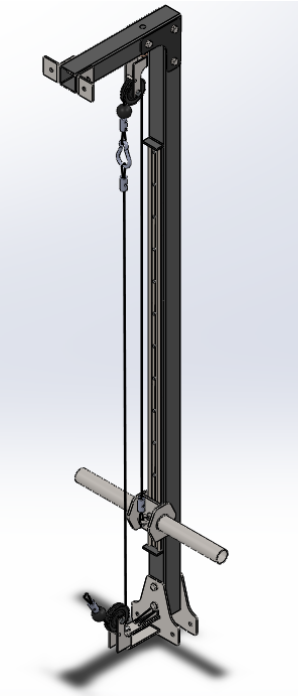
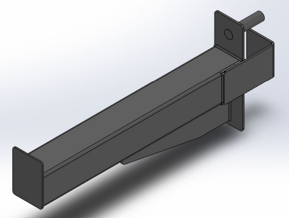

# Estructura de Entrenamiento Multifunción

## Descripción del Proyecto

Este proyecto consiste en el diseño y cálculo estructural de una estructura de entrenamiento multifunción para uso doméstico. El objetivo es crear un equipo de entrenamiento versátil y asequible para el hogar.

## Tecnologías Utilizadas

- **Modelado 3D**: SolidWorks
- **Análisis FEM**: SolidWorks
- **Documentación Técnica**: AutoCAD

## Contenidos del Repositorio

- `/modelos_cad`: Contiene los archivos CAD en formatos .stl, .step, .iges.
- `/analisis_fem`: Resultados y scripts de análisis FEM realizados en SolidWorks.
- `/documentacion`: Planos técnicos y documentación del proyecto en formato PDF.

## Instalación y Uso

Para visualizar y modificar los modelos CAD:

1. Clonar el repositorio: `git clone https://github.com/sergio-moldes/entrenamiento-multifuncion.git`
2. Abrir los archivos en SolidWorks.

## Contribuciones

Las contribuciones son bienvenidas. Por favor, abre un issue o envía un pull request para discutir cualquier cambio que desees realizar.

## Licencia

Este proyecto está licenciado bajo la Licencia MIT - ver el archivo [LICENSE](LICENSE) para más detalles.

## Documentación del Proyecto

El proyecto se ha documentado exhaustivamente en el siguiente archivo PDF: [Memoria de Estructura de Entrenamiento Multifunción](documentacion/Memoria_entrenamiento_multifuncion.pdf)

### Resumen de la Memoria

#### 1. Introducción

Se describe el objetivo del proyecto y una visión general del diseño de la estructura de entrenamiento multifunción.

#### 2. Cálculos y Diseño

Explicación detallada de los cálculos realizados para garantizar la estabilidad y seguridad de la estructura, así como el proceso de diseño en CAD.

### Imágenes del Proyecto

Aquí se incluyen algunas imágenes del diseño final en CAD:

